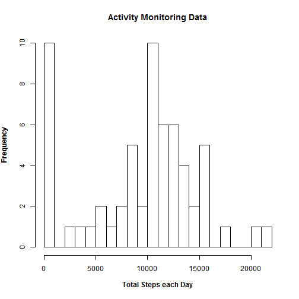
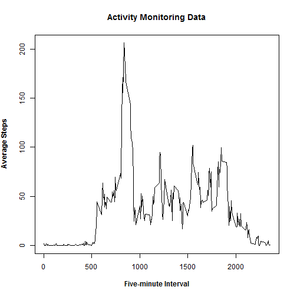
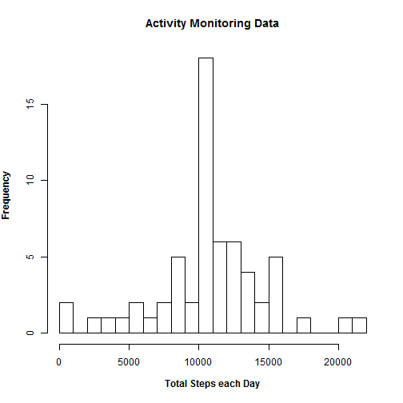
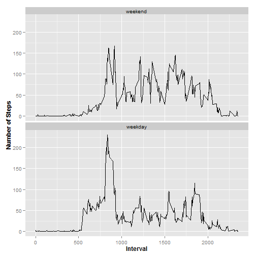

## Loading and preprocessing the data


```r
library(ggplot2)
```

```
## Warning: package 'ggplot2' was built under R version 3.1.2
```

```r
unzip("activity.zip", "activity.csv")
raw_data <- read.csv("activity.csv")
raw_data$date <- as.Date(raw_data$date)
```

## What is mean total number of steps taken per day?

```r
daily_steps <- aggregate(raw_data$steps, by=list(raw_data$date), FUN=sum, na.rm=TRUE)
colnames(daily_steps) <- c("date","total_steps")

hist(daily_steps$total_steps,breaks=30,
     xlab=expression(bold("Total Steps each Day")),ylab=expression(bold("Frequency")),
     main=expression(bold('Activity Monitoring Data')),)
```

 

```r
mean(daily_steps$total_steps, na.rm=TRUE)
```

```
## [1] 9354.23
```

```r
median(daily_steps$total_steps, na.rm=TRUE)
```

```
## [1] 10395
```


## What is the average daily activity pattern?

```r
interval_steps <- 
  aggregate(raw_data$steps, by=list(raw_data$interval), FUN=mean, na.rm=TRUE)
colnames(interval_steps) <- c("interval","mean_steps")

plot(interval_steps$interval,interval_steps$mean_steps,type="l",
     xlab=expression(bold("Five-minute Interval")),ylab=expression(bold("Average Steps")),
     main=expression(bold('Activity Monitoring Data')))
```

 

```r
max_step_interval <- 
  interval_steps[interval_steps$mean_steps==max(interval_steps$mean_steps, na.rm=TRUE),
                 "interval"]
```
The interval that averages the most steps is 835.

## Imputing missing values

```r
n_missing_step_intervals <- sum(is.na(raw_data[,"steps"]))
n_intervals <- length(raw_data[,"steps"])
```
There are 2304 intervals without data, out of 17568 total intervals.

Missing data are replaced by the average for each interval. 

```r
filled_data <- raw_data
for (i in 1:dim(filled_data)[1]){
  if (is.na(filled_data[i,"steps"])){
    filled_data[i,"steps"] <- 
    interval_steps[interval_steps$interval==filled_data[i,"interval"],"mean_steps"]
  }
}

daily_steps <- aggregate(filled_data$steps, by=list(filled_data$date), FUN=sum, na.rm=TRUE)
colnames(daily_steps) <- c("date","total_steps")

hist(daily_steps$total_steps,breaks=30,
     xlab=expression(bold("Total Steps each Day")),ylab=expression(bold("Frequency")),
     main=expression(bold('Activity Monitoring Data')),)
```

 

```r
mean(daily_steps$total_steps, na.rm=TRUE)
```

```
## [1] 10766.19
```

```r
median(daily_steps$total_steps, na.rm=TRUE)
```

```
## [1] 10766.19
```
These values are different from the mean and median calculated earlier, (although surprisingly equal to each other). 

The effect of filling all the previous NA data with averages for that interval is to increase to total number of steps over all the days. 

## Are there differences in activity patterns between weekdays and weekends?

```r
day_of_week <- weekdays(filled_data[,"date"])

index <- day_of_week %in% c("Saturday","Sunday")
filled_data[index,"day_type"] <- "weekend"
filled_data[!index,"day_type"] <- "weekday"

filled_data$day_type <- factor(filled_data$day_type, levels = c("weekend","weekday"))

interval_steps <- aggregate(filled_data$steps, 
                            by=list(filled_data$interval,filled_data$day_type),
                            FUN=mean)
colnames(interval_steps) <- c("interval","day_type","mean_steps")

g <- ggplot(interval_steps,aes(interval,mean_steps))
p <- (g + geom_line()
  + labs(x=expression(bold("Interval")),y=expression(bold("Number of Steps")))
  + facet_wrap(~day_type, ncol=1)) 
print(p)
```

 

